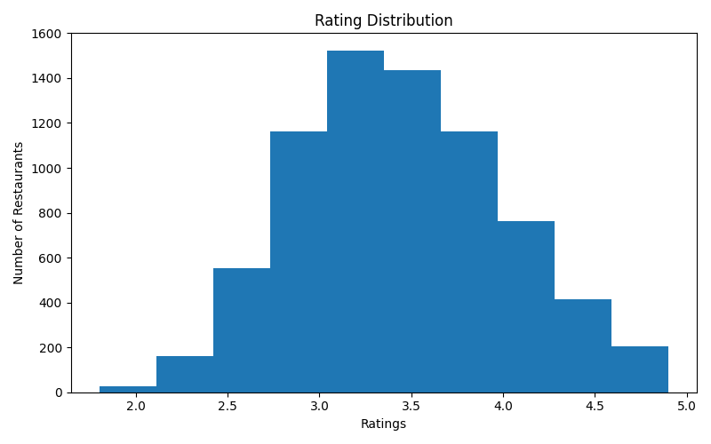

# COGNIFYZ - DATA ANALYSIS LEVEL 2 TASK 3

## 📌 Project Overview
This project focuses on analyzing restaurant ratings to understand customer satisfaction and rating distribution patterns among restaurants.

---

## 🛠 Tools & Technologies Used
- Python
- Pandas
- Matplotlib

---

## 🎯 Objective
The objectives of this task are:
- Analyze restaurant rating distribution
- Identify average, maximum, and minimum ratings
- Visualize customer satisfaction trends
- Understand restaurant performance patterns

---

## 📂 Dataset Description
The dataset contains restaurant information including:
- Restaurant names
- Aggregate ratings
- Cuisine types
- Price ranges
- Online delivery availability
- Table booking services

---

## ⚙️ Steps Performed
1. Loaded dataset using pandas
2. Extracted restaurant ratings
3. Removed invalid or zero ratings
4. Calculated rating statistics
5. Created histogram visualization

---

## 📊 Data Visualization

### 🔹 Rating Distribution

---

## 🔍 Key Insights
- Most restaurants have ratings between 3.0 and 4.5
- Very low-rated restaurants are fewer
- High customer ratings indicate good service quality
- Rating analysis helps identify customer satisfaction levels

---

## 📈 Business Recommendations
- Restaurants should improve customer service quality
- Businesses can monitor customer feedback regularly
- Higher ratings help attract more customers

---

## ✅ Conclusion
Rating distribution analysis helps understand customer satisfaction and restaurant performance. Businesses can use ratings to improve service quality and customer experience.